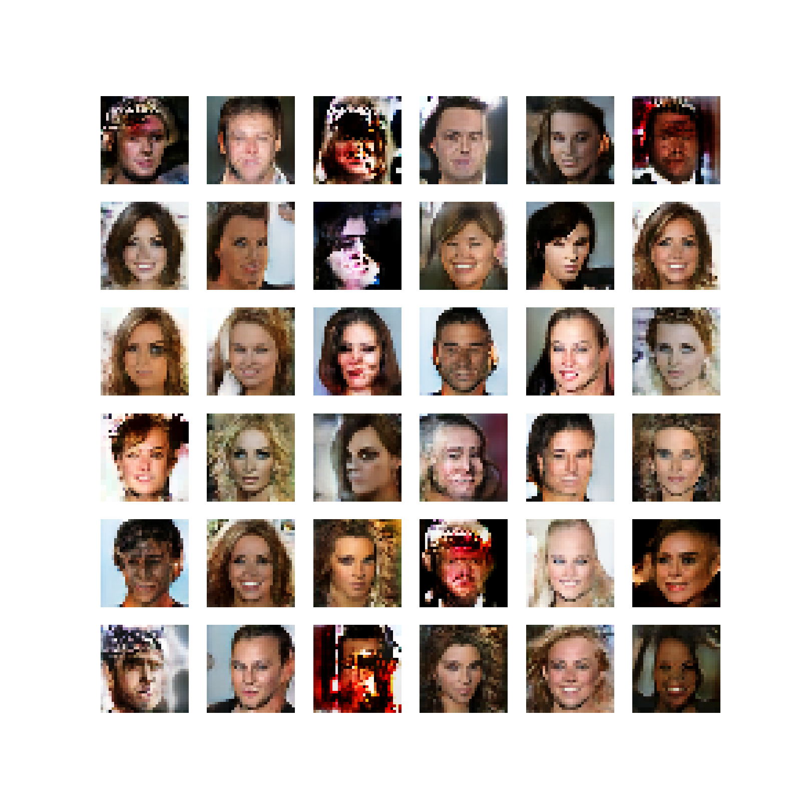

# ProGAN - Progressive Growing of GANs


## Overview

This repository contains the implementation of ProGAN (Progressive Growing of GANs), a state-of-the-art generative model architecture for generating high-quality images. ProGAN was first introduced in the paper ["Progressive Growing of GANs for Improved Quality, Stability, and Variation"](https://arxiv.org/abs/1710.10196) by Tero Karras et al.
The Notebook included in this repo is strictly based on the above reseach paper

The ProGAN model is trained progressively, starting from a low resolution and gradually increasing the resolution during training. This progressive training process allows the model to learn finer details and produce high-resolution images.

## Model Architecture

The ProGAN architecture consists of a generator and a discriminator. The generator takes random noise as input and generates images, while the discriminator distinguishes between real and fake images. As the training progresses, both the generator and discriminator are gradually updated to handle higher-resolution images.

## Requirements

- Python (>=3.6)
- TensorFlow (>=2.0)
- High Power GPU

## Training

To train the ProGAN model, follow these steps:

1. Prepare your dataset and set the data path in the code.
2. Set the hyperparameters and training configuration in the code.
3. Run the training script.


## Generated Samples

During training, the model will generate samples at different resolutions. Some generated samples are shown above.<br>
Please note that due to computational limitation i trained model only to 32x32 image but PROGAN can generate images upto 1024x1024 resolution<br>
Also this notebook is trained on Kaggle with Tesla P100 GPU for 12 hours and and the required time for complete training is 83 hours.

## Results
The trained ProGAN model is capable of generating high-quality images with impressive details. Below are some sample generated images:




## Usage

You can use the trained ProGAN model to generate new images. Here's how to generate images using the pre-trained model:

```python
# Load the pre-trained model
model = load_model('pggan_generator_128.h5')

# Generate new images
generated_images = model.generate_images(num_samples=10)
```

## Acknowledgments

The implementation of ProGAN is based on the original paper by Tero Karras et al. and open-source implementations available in the community.<br>
Special Thanks to Github Community and Kaggle Notebooks for the resources and Dataset.

## License

This project is licensed under the MIT License - see the [LICENSE](LICENSE) file for details.

